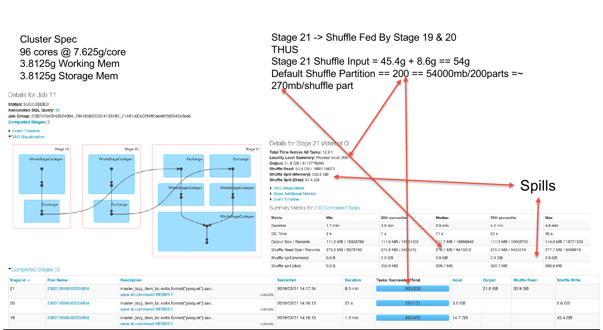
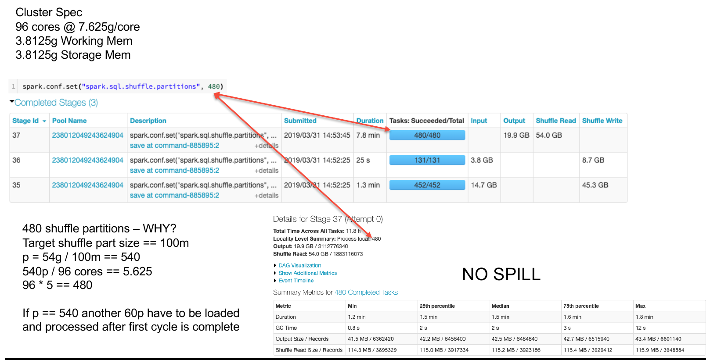
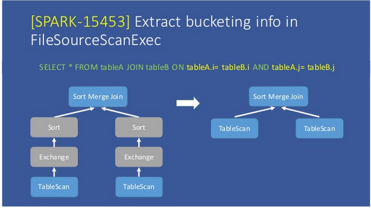
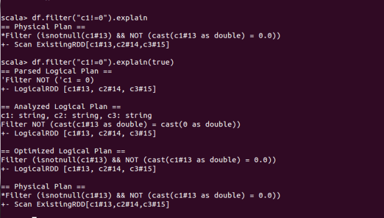
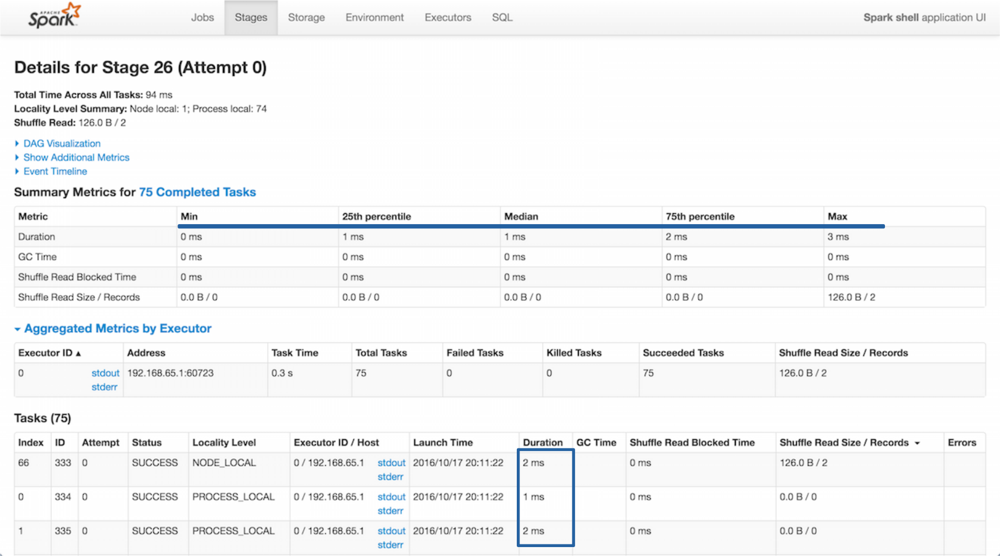
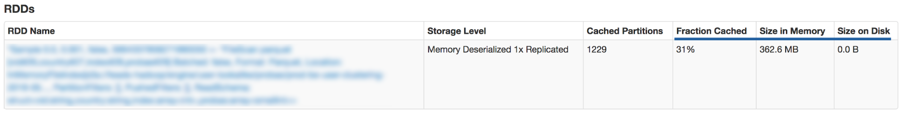
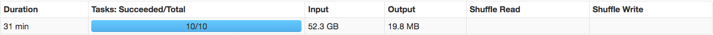
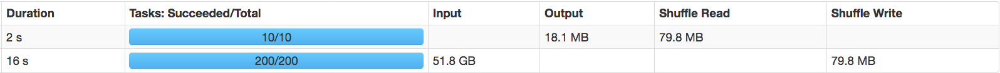
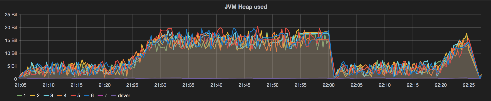

# Spark Optimization

* Avoid `groupBy` and prefer `reduceBy`

  ```scala
  val a = sc.parallelize(List("dog", "cat", "owl", "gnu", "ant"), 2)
  val b = a.map(x => (x.length, x))
  b.reduceByKey(_ + _).collect
  // b.groupByKey().mapValues(_.mkString("")).collect()
  // Array[(Int, String)] = Array((3,dogcatowlgnuant))
  
  val a = sc.parallelize(List("dog", "tiger", "lion", "cat", "panther", "eagle"), 2)
  val b = a.map(x => (x.length, x))
  b.reduceByKey(_ + _).collect
  //// b.groupByKey().mapValues(_.mkString("")).collect()
  // Array[(Int, String)] = Array((4,lion), (3,dogcat), (7,panther), (5,tigereagle))
  ```

* **Partitions**

  * At input level
    * `spark.default.parallelism`(don't use)
    * `spark.sql.files.maxPartitionBytes`
      * Use default partition size **128MB** , unless
        * Increase parallelism
        * Heavily nested/repeated data
        * Generating data
        * Source structure is not optimal
        * UDFs
        * 
        * 
  * At shuffle level
    * `sparl.sql.shuffle.partitions`
    * Default maximum size is **2GB**
    * * 

  - At ouput level

    - Coalesce to shrink number of partitions
    - Repartition to increase the number of partitions
    - `df.write.option("maxRecordsPerFile", N)`

  - **Never rely on default partition size of `200` at any cost**

    - ```
      Say if you have data size of 210GB
      number_partitions = 210000MB / 200MB = 1050
      # irrespective of number of cores
      spark.conf.set("Spark.sql.shuffle.paritions", 1050)
      # say if the cluster has 2000 cores
      spark.conf.set("Spark.sql.shuffle.paritions", 2000)
      ```

    - 

    - 

* **Broadcast DataFrame** Join for small data files

  - Default size is 10MB

  - Spark SQL uses **broadcast join** (aka **broadcast hash join**) instead of hash join to optimize join queries when the size of one side data is below [spark.sql.autoBroadcastJoinThreshold](https://jaceklaskowski.gitbooks.io/mastering-spark-sql/spark-sql-properties.html#spark.sql.autoBroadcastJoinThreshold).

  - Broadcast allows to send a read-only variable cached on each node once, rather than sending a copy for all tasks. 

  -  Requires to use Hive and its metastore for auto detection of table size
    
    ```scala
    leftDF.join(broadcast(rightDF))
    ```

- **Put the Largest Dataset on the Left**

  - When you’re joining together two datasets where one is smaller than the other, put the larger dataset on the “Left”:

  ```
  val joinedDF = largerDF.leftJoin(smallerDF, largerDF("id") === smallerDF("some_id"))
  ```

  - When Spark shuffles data for the join, it keeps the data you specified on  the left static on the executors and transfers the data you designed on  the right between the executors. If the data that’s on the right, that’s being transferred, is larger, then the serialization and transfer of  the data will take longer.


* Hive **Bucketing**

  * Consider when there is a high hashable column values

  * `spark.sql.sources.bucketing.enabled=True`

  * Set  `hive.enforce.bucketing=false` and `hive.enforce.sorting=false`

  * https://www.slideshare.net/databricks/hive-bucketing-in-apache-spark-with-tejas-patil

  * ```scala
    df.write
      .bucketBy(numBuckets, "col1", ...)
      .sortBy("col1", ...)
      .saveAsTable("/path/table_name")
    ```

  * ```sql
    create table table_name(col1 INT, ...)
    	using parquet
    	CLUSTERED By (col1, ...)
    	SORTED BY(col1, ...)
    	INTO `numBuckets` BUCKETS
    ```

  * 

- **Data Serialisation**

  - It is the process of converting the in-memory object to another format  that can be used to store in a file or send over the network.
  - Two options
    - Java serialization
    - Kryo serialization
  - Configuration : “spark.serializer” to “org.apache.spark.serializer.KyroSerializer"

- Avoid User defined Function **UDFs** and User Defined Aggregate Funtions **UDAF** 

  - Prefer in build SQL Functions where ever possible
  - https://databricks.com/blog/2015/04/13/deep-dive-into-spark-sqls-catalyst-optimizer.html
  - https://fr.slideshare.net/cfregly/advanced-apache-spark-meetup-project-tungsten-nov-12-2015

- **Analyse Execution plan**

  - Stages are created when there is a need for shuffle for operations like `join` or `groupBy`

  - **Number of stages**

    * Thought the Spark engine does pretty good job of optimizing the DAGs for executions, it is also developer responsibility to keep the number of stages under a reasonable number.
    * This involves good amount of understanding of APIs and SQL query optimization

  - We use the` .explain(true)` command to show the execution plan detailing all the steps (stages) involved for a job. Here is an example:

    

- **Highly imbalanced dataset**

  - To quickly check if everything is ok we review the execution duration of each task and look for **heterogeneous process time**. If one of the tasks is significantly slower than the others it will  extend the overall job duration and waste the resources of the fastest  executors.

    

- **Inappropriate use of caching**

  There is no universal answer when choosing what should be cached. Caching an intermediate result can **dramatically improve performance** and it’s tempting to cache a lot of things. However, due to Spark’s  caching strategy (in-memory then swap to disk) the cache can end up in a slightly slower storage. Also, using that storage space for caching  purposes means that it’s not available for processing. In the end,  caching might cost more than simply reading the *DataFrame*.

  In the *Storage* tab of the UI we verify the *Fraction Cached* and also look at the *Size in Memory* and *Size on Disk* distribution.

  

- Try alternatives for AWS EMR with plain EC2 

  - https://github.com/nchammas/flintrock
  - https://heather.miller.am/blog/launching-a-spark-cluster-part-1.html

- **Pitfalls with AWS S3**

  - A simple renaming actually needs to copy and then delete the original file.

  - The first [workaround](https://medium.com/@subhojit20_27731/apache-spark-and-amazon-s3-gotchas-and-best-practices-a767242f3d98) when using Spark with S3 as an output it to use this specific configuration:

    ```shell
    spark.hadoop.mapreduce.fileoutputcommitter.algorithm.version 2 spark.speculation false
    ```


- **Parquet**

  - Columnar storage format
  - Spark can leverage **predicate push down** (i.e. pushing down the filtering closer to the data).
  - However, predicate pushdown should be used with extra care. Even if it appears in the execution plan, **it will not always be effective**. For example, a filter push-down does not work on String and Decimal data types (cf[ PARQUET-281](https://issues.apache.org/jira/browse/PARQUET-281)).

- **Monitoring spark applications**

  - Spark includes a configurable metrics system based on the [*dropwizard.metrics*](http://metrics.dropwizard.io/) library. It is set up via the Spark configuration. As we already are heavy users of **Graphite** and **Grafana**, we use the provided [Graphite sink](https://www.hammerlab.org/2015/02/27/monitoring-spark-with-graphite-and-grafana/).

    The Graphite sink needs to be **used with caution**. This is due to the fact that, for each metric, Graphite creates a fixed-size database to store data points. These zeroed-out [*Whisper*](https://graphite.readthedocs.io/en/latest/whisper.html) files consume quite a lot of disk space.

    By default, the application id is added to the namespace, which means that every *spark-submit* operation creates a new metric. Thanks to [SPARK-5847](https://issues.apache.org/jira/browse/SPARK-5847) it is now possible to **mitigate the \*Whisper\* behavior** and remove the *spark.app.id* from the namespace.

  ```
  	spark.metrics.namespace=$name
  ```

  

  - https://github.com/hammerlab/grafana-spark-dashboards
    - https://www.hammerlab.org/2015/02/27/monitoring-spark-with-graphite-and-grafana/
  - https://github.com/qubole/sparklens

- **Java Garbage Collection**

  - Analyse the logs for the memory usage, most likely the problem would be with the data partitions.
  - https://spark.apache.org/docs/latest/tuning.html#garbage-collection-tuning
  - EMR : https://docs.aws.amazon.com/emr/latest/ManagementGuide/emr-plan-debugging.html
  - Tool to analyse the logs: https://gceasy.io/

- Coalesce vs repartition

  In the literature, it’s often mentioned that *coalesce* should be preferred over *repartition* to reduce the number of partitions because it avoids a shuffle step in some cases.

  But ***coalesce\* has some limitations** (outside the scope of this article): it cannot increase the number of partitions and may generate skew partitions.

  Here is one case where a **repartition should be preferred**. In this case, we filter most of a dataset.

  ```
  df.doSth().coalesce(10).write(…)
  ```

  

  

  The good point about *coalesce* is that it avoids a shuffle. However, all the computation is done by only 10 tasks.

  This is due to the fact that **the number of tasks depends on the number of partitions of the output of the stage**, each one computing a big bunch of data. So a maximum of 10 nodes will perform the computation.

  ```
  df.doSth().repartition(10).write(…)
  ```

  

  Using *repartition* we can see that the total duration is way shorter (a few seconds  instead of 31 minutes). The filtering is done by 200 tasks, each one  working on a small subset of data. It’s also way smoother from a memory  point a view, as we can see in the graph below.

  

  JVM Heap monitoring


- **COMPUTE STATISTICS** of Tables Before Processing

  - Before querying a series of tables, it can be helpful to tell spark to Compute the Statistics of those tables so that the Catalyst Optimizer can come  up with a better plan on how to process the tables.

  ```
  spark.sql("ANALYZE TABLE dbName.tableName COMPUTE STATISTICS")
  ```

  - In some cases, Spark doesn’t get everything it needs from just the above  broad COMPUTE STATISTICS call. It also helps to tell Spark to check  specific columns so the Catalyst Optimizer can better check those  columns. It’s recommended to COMPUTE STATISTICS for any columns that are involved in filtering and joining.

```
spark.sql("ANALYZE TABLE dbName.tableName COMPUTE STATISTICS FOR COLUMNS joinColumn, filterColumn")
```

- Avoid calling **DataFrame/RDD `count` API** unless it is absolutely necessary. 

- **Data Skew**
  - Common symptoms of data skew are:
    - Frozen stages and tasks.
    - Low utilization of CPU.
    - Out of memory errors.
  - Data broadcast during join operation can help with minimize the data skew side effects. Increase the `spark.sql.autoBroadcastJoinThreshold` for Spark to consider tables of bigger size. Make sure enough memory is available in driver and executors
  - Salting
    - In a SQL join operation, the join key is changed to redistribute data in an even manner so that processing for a partition does not take more  time. This technique is called salting.
    - Can we add something to the so that our dataset will be more evenly  distributed? Most of users with skew problems use the salting technique. Salting is a technique where we will add random values to the join key  of one of the tables. In the other table, we need to replicate the rows  to match the random keys. The idea is if the join condition is satisfied by key1 == key1, it should also get satisfied by key1_<salt> =  key1_<salt>. The value of salt will help the dataset to be more  evenly distributed.


## Good reads

- https://medium.com/teads-engineering/lessons-learned-while-optimizing-spark-aggregation-jobs-f93107f7867f
- https://www.slideshare.net/databricks/apache-spark-coredeep-diveproper-optimization